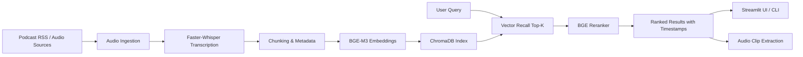

# PodSearch

English | [中文](README_zh.md)

Semantic search for podcast archives with multilingual retrieval, timestamp-level results, and playable audio snippets.


## Overview

PodSearch turns long-form podcast audio into a searchable semantic knowledge base. It downloads podcast episodes, transcribes speech into timestamped text, builds chunk-level embeddings, and returns the most relevant segments for a natural-language query.

The project is designed for:

- podcast archive search
- topic research and knowledge discovery
- cross-show semantic retrieval
- creator and team workflows that need searchable audio libraries

## Table of Contents

- Overview
- Features
- Architecture
- Search Pipeline
- Tech Stack
- Repository Structure
- Quick Start
- Evaluation
- Current Coverage
- Roadmap

## Features

- Multilingual semantic retrieval across Chinese and English podcast content
- Two-stage search pipeline with vector recall and reranking
- Timestamp-level results for fast navigation inside long episodes
- Playable audio snippets generated directly from matched segments
- Streamlit demo interface with podcast-level filtering
- Offline ingestion pipeline for download, transcription, chunking, embedding, and indexing
- Built-in evaluation scripts for ranking quality analysis

## Architecture



PodSearch has two major stages:

1. Offline indexing: ingest podcast audio, transcribe episodes with `Faster-Whisper`, split transcripts into retrieval-friendly chunks, and store vectors in `ChromaDB`.
2. Online retrieval: embed the user query, recall candidates from the vector index, rerank them with `BGE-Reranker-v2-M3`, and return the most relevant timestamped segments.

## Search Pipeline

```text
User query
  -> embed with BGE-M3
  -> retrieve Top-30 candidates from ChromaDB
  -> rerank with BGE-Reranker-v2-M3
  -> return Top-10 results
  -> generate playable audio clips from timestamps
```

## Tech Stack

| Layer | Stack | Purpose |
| --- | --- | --- |
| Speech Recognition | Faster-Whisper (`tiny`) | Podcast ASR with timestamps |
| Embeddings | `BAAI/bge-m3` | Multilingual dense embeddings |
| Reranking | `BAAI/bge-reranker-v2-m3` | Precision-oriented reranking |
| Vector Database | ChromaDB | Persistent local vector storage |
| Processing | `feedparser`, `requests`, `pydub`, `PyYAML`, `tqdm` | Ingestion and audio pipeline |
| Interface | Streamlit | Local search interface |
| Runtime | Python 3 | Pipeline orchestration |

## Repository Structure

```text
podsearch/
├── app/
│   └── streamlit_app.py
├── data/
│   ├── raw_audio/
│   ├── transcripts/
│   ├── clips/
│   └── chroma_db/
├── docs/
│   └── assets/
├── eval/
│   ├── evaluate.py
│   └── queries.json
├── scripts/
│   ├── add_new_podcast.py
│   └── build_index.py
├── src/
│   ├── audio_clip.py
│   ├── config.py
│   ├── embedding.py
│   ├── indexing.py
│   ├── ingest.py
│   ├── pipeline.py
│   ├── search.py
│   └── transcribe.py
├── build_vector.py
├── download_all.py
├── transcribe_all.py
├── retrieve.py
├── podcasts.yaml
├── README.md
├── README_zh.md
└── requirements.txt
```

## Quick Start

### 1. Install dependencies

```bash
python3 -m venv .venv
source .venv/bin/activate
pip install -r requirements.txt
```

### 2. Configure podcast sources

Edit `podcasts.yaml` to define podcast names, language, and the number of episodes to fetch.

### 3. Download episodes

```bash
python3 download_all.py
```

### 4. Transcribe audio

```bash
python3 transcribe_all.py
```

### 5. Build the vector index

```bash
python3 build_vector.py
```

### 6. Launch the Streamlit app

```bash
streamlit run app/streamlit_app.py
```

### 7. Or use the CLI

```bash
python3 retrieve.py
```

## Evaluation

The repository includes `eval/queries.json` and `eval/evaluate.py` for baseline ranking evaluation.

| Metric | Score |
| --- | ---: |
| MRR | 0.825 |
| Recall@10 | 1.000 |
| Precision@10 | 0.630 |

These results indicate strong first-hit quality on covered topics and solid top-10 usefulness for exploratory podcast search.

## Current Coverage

The current `podcasts.yaml` includes a mixed Chinese-English podcast set, such as:

- Lex Fridman Podcast
- Acquired
- The Indicator
- ESL Podcast
- All Ears English
- 硅谷101
- 纵横四海
- 知行小酒馆
- 忽左忽右
- 罗永浩的十字路口

## Roadmap

- Add a production API layer for remote search requests
- Introduce richer metadata filters such as language, date, and show tags
- Support incremental indexing for newly published episodes
- Improve chunking strategies and retrieval diagnostics
- Expand evaluation with judged search outputs
- Package the project for creator or team deployment workflows

## License

This repository does not currently declare an explicit open-source license.
