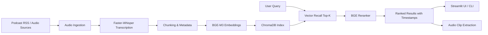

# PodSearch

Semantic search for podcast archives with multilingual retrieval, timestamp-level results, and playable audio snippets.

一个面向播客内容库的语义搜索系统，支持中英文检索、时间戳级命中结果，以及可直接回放的音频片段。


## 项目简介 | Overview

**中文**

`PodSearch` 将播客从“只能顺序听”的音频内容，转化为“可以按语义检索”的知识库。系统会批量抓取播客音频、完成转写、切分文本片段、构建向量索引，并在查询时通过“向量召回 + Cross-Encoder 精排”返回最相关的片段、时间范围和原始文本。

它适合用于：

- 播客知识库检索
- 选题研究与内容回看
- 多节目语义聚合搜索
- 构建个人或团队的音频内容搜索引擎

**English**

`PodSearch` turns long-form podcast audio into a searchable semantic knowledge base. It ingests podcast episodes in batch, transcribes audio, builds chunk-level embeddings, and serves retrieval results with timestamps, transcript snippets, and playable audio clips through a two-stage search pipeline.

Typical use cases include:

- podcast archive search
- topic discovery and content research
- cross-show semantic retrieval
- building a private audio search engine for creators or teams

## 核心能力 | Key Features

- **多语言语义检索 / Multilingual semantic retrieval**: supports both Chinese and English podcast content and queries.
- **两阶段搜索架构 / Two-stage retrieval pipeline**: vector recall with ChromaDB, followed by Cross-Encoder reranking for better relevance.
- **时间戳级返回 / Timestamp-level results**: every hit includes start and end times for fast navigation.
- **片段试听 / Playable audio snippets**: automatically cuts and caches local MP3 clips for result preview.
- **播客筛选 / Podcast-level filtering**: Streamlit interface supports filtering by show.
- **离线数据流水线 / Offline ingestion pipeline**: batch download, transcription, chunking, embedding, and indexing.
- **可评估 / Evaluatable**: includes benchmark scripts and a query set for MRR / Recall@K / Precision@K analysis.

## 系统架构 | System Architecture



**中文**

系统分为两部分：

1. **离线构建阶段**：下载播客音频，使用 `Faster-Whisper` 做 ASR 转写，生成文本片段和向量，并写入 `ChromaDB`。
2. **在线检索阶段**：将用户 query 向量化，先做向量召回，再使用 `BGE-Reranker-v2-M3` 精排，最后返回最相关的文本片段和时间戳。

**English**

The system consists of:

1. **Offline indexing**: fetch podcast audio, transcribe with `Faster-Whisper`, build chunk metadata and embeddings, then persist vectors into `ChromaDB`.
2. **Online retrieval**: embed the user query, perform approximate vector recall, rerank candidates with `BGE-Reranker-v2-M3`, and return ranked transcript segments with timestamps.

## 检索流程 | Retrieval Flow

**中文**

```text
用户查询
  -> BGE-M3 向量化
  -> ChromaDB 召回 Top-30
  -> BGE Reranker 精排
  -> 返回 Top-10 片段
  -> 根据时间戳裁剪并播放音频
```

**English**

```text
User query
  -> embed with BGE-M3
  -> retrieve Top-30 from ChromaDB
  -> rerank with BGE Reranker
  -> return Top-10 ranked segments
  -> generate playable audio clips from timestamps
```

## 界面与交互 | Interface

**中文**

当前项目提供一个 `Streamlit` 演示界面，支持：

- 输入自然语言 query
- 查看相关度排序结果
- 查看命中文本片段
- 查看对应时间戳
- 试听裁剪后的音频片段
- 按播客节目过滤结果

**English**

The current project includes a `Streamlit` demo application with:

- natural-language query input
- ranked retrieval results
- transcript snippet preview
- timestamp display
- inline audio playback
- show-level filtering

## 技术栈 | Tech Stack

| Layer | Stack | Purpose |
| --- | --- | --- |
| Speech Recognition | Faster-Whisper (`tiny`) | Transcribe podcast audio into timestamped text |
| Embeddings | `BAAI/bge-m3` | Multilingual dense embedding generation |
| Reranking | `BAAI/bge-reranker-v2-m3` | Re-rank recalled candidates for higher precision |
| Vector Database | ChromaDB | Persistent local vector index |
| Data Processing | `feedparser`, `requests`, `pydub`, `PyYAML`, `tqdm` | Podcast ingestion, audio processing, configuration |
| Interface | Streamlit | Local search UI and result exploration |
| Runtime | Python 3 | End-to-end pipeline orchestration |

## 项目结构 | Repository Structure

```text
podsearch/
├── app/
│   └── streamlit_app.py        # Streamlit search interface
├── data/
│   ├── raw_audio/              # Downloaded podcast audio
│   ├── transcripts/            # ASR outputs in JSON
│   ├── clips/                  # Cached audio snippets for playback
│   └── chroma_db/              # Persistent vector database
├── eval/
│   ├── evaluate.py             # Evaluation script
│   └── queries.json            # Benchmark queries
├── scripts/
│   ├── add_new_podcast.py
│   └── build_index.py
├── src/
│   ├── audio_clip.py           # Clip generation from timestamps
│   ├── config.py               # Central configuration
│   ├── embedding.py            # Embedding model wrapper
│   ├── indexing.py             # ChromaDB access
│   ├── ingest.py               # Podcast ingestion
│   ├── pipeline.py             # End-to-end pipeline orchestration
│   ├── search.py               # Retrieval + reranking
│   └── transcribe.py           # Whisper transcription
├── build_vector.py             # Build vector index from transcripts
├── download_all.py             # Batch download podcast episodes
├── transcribe_all.py           # Batch transcription
├── retrieve.py                 # CLI search entry
├── podcasts.yaml               # Podcast source configuration
└── requirements.txt            # Python dependencies
```

## 快速开始 | Quick Start

### 1. 安装依赖 | Install dependencies

```bash
python3 -m venv .venv
source .venv/bin/activate
pip install -r requirements.txt
```

### 2. 配置播客源 | Configure podcast sources

在 `podcasts.yaml` 中配置播客节目、语言和抓取数量。

Configure podcast feeds, language, and episode limits in `podcasts.yaml`.

### 3. 下载音频 | Download audio

```bash
python3 download_all.py
```

### 4. 批量转写 | Run transcription

```bash
python3 transcribe_all.py
```

### 5. 构建向量索引 | Build the vector index

```bash
python3 build_vector.py
```

### 6. 启动检索界面 | Launch the search UI

```bash
streamlit run app/streamlit_app.py
```

### 7. 或使用命令行检索 | Or use the CLI

```bash
python3 retrieve.py
```

## 数据流水线 | Data Pipeline

**中文**

项目的数据处理链路如下：

1. 从 `podcasts.yaml` 读取播客配置
2. 下载对应节目音频
3. 使用 Whisper 模型转写为分段文本
4. 将转录结果切分为适合检索的语义片段
5. 使用 `BGE-M3` 生成向量
6. 将向量和元数据写入 `ChromaDB`
7. 在查询时做召回、精排和音频片段播放

**English**

The end-to-end data pipeline is:

1. load podcast definitions from `podcasts.yaml`
2. fetch episode audio files
3. transcribe speech into timestamped segments
4. split transcripts into retrieval-friendly chunks
5. generate embeddings with `BGE-M3`
6. store vectors and metadata in `ChromaDB`
7. serve reranked search results with audio preview

## 评估结果 | Evaluation

**中文**

仓库内提供了 `eval/queries.json` 和 `eval/evaluate.py` 作为基础评估基线。根据当前评估集，系统记录到的指标为：

| Metric | Score |
| --- | ---: |
| MRR | 0.825 |
| Recall@10 | 1.000 |
| Precision@10 | 0.630 |

这些指标说明系统在已覆盖主题上的首条命中能力较强，同时前 10 条结果的整体相关性具有较好的可用性。

**English**

The repository includes `eval/queries.json` and `eval/evaluate.py` for baseline evaluation. The current benchmark values recorded from the repository query set are:

| Metric | Score |
| --- | ---: |
| MRR | 0.825 |
| Recall@10 | 1.000 |
| Precision@10 | 0.630 |

These numbers suggest strong first-hit ranking quality on covered topics, while overall top-10 precision remains practically useful for exploratory podcast search.

## 当前支持 | Current Coverage

**中文**

当前 `podcasts.yaml` 已包含多档中英文节目，例如：

- Lex Fridman Podcast
- Acquired
- The Indicator
- ESL Podcast
- All Ears English
- 硅谷101
- 纵横四海
- 知行小酒馆
- 忽左忽右
- 罗永浩的十字路口

**English**

The current configuration already includes a mixed Chinese-English podcast set, including:

- Lex Fridman Podcast
- Acquired
- The Indicator
- ESL Podcast
- All Ears English
- 硅谷101
- 纵横四海
- 知行小酒馆
- 忽左忽右
- 罗永浩的十字路口

## 适合继续完善的方向 | Roadmap

- Add a production API layer for remote search requests
- Introduce richer metadata filters such as language, date, and show tags
- Support incremental indexing for newly published episodes
- Add better chunking strategies and retrieval diagnostics
- Improve evaluation with real judged search outputs instead of static benchmark metadata
- Package deployment for local teams or creator workflows

## License

This project currently does not declare an explicit open-source license.

本项目当前仓库中尚未声明明确的开源许可证。
