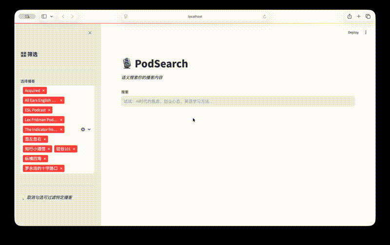
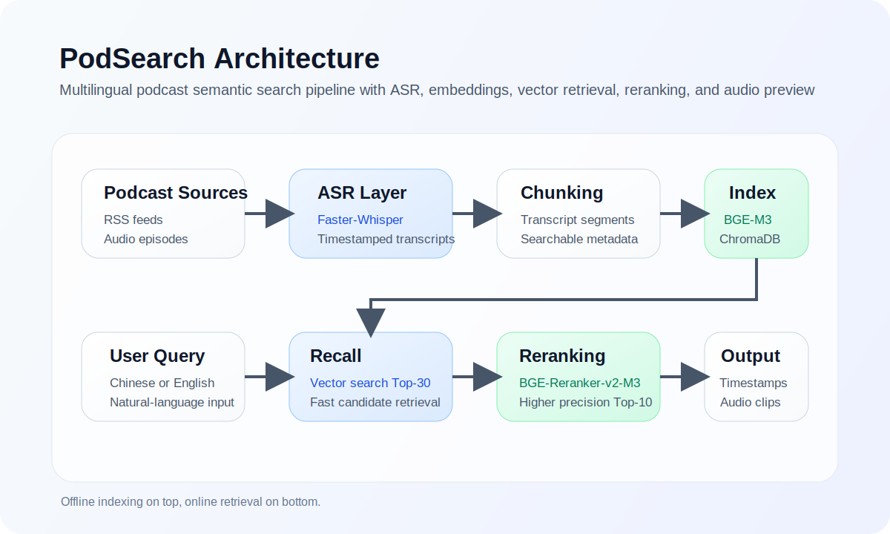
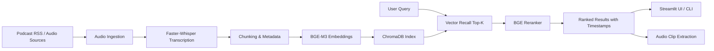

# PodSearch

[English](README.md) | 中文

一个面向播客内容库的语义搜索系统，支持中英文检索、时间戳级命中结果，以及可直接回放的音频片段。




## 项目简介

PodSearch 的目标是把“只能顺序播放”的播客内容，转化为“可以按语义检索”的知识库。系统会自动下载播客音频、完成转写、构建文本片段与向量索引，并在搜索时返回最相关的时间段、文本内容和对应音频片段。

它适合用于：

- 播客知识库检索
- 选题研究与内容回看
- 多节目内容聚合搜索
- 个人或团队的音频内容检索系统

## 目录

- 项目简介
- 核心能力
- 系统架构
- 检索流程
- 技术栈
- 项目结构
- 快速开始
- 评估结果
- 当前支持
- Roadmap

## 核心能力

- 支持中英文播客内容的语义检索
- 采用“向量召回 + Cross-Encoder 精排”的两阶段检索架构
- 返回时间戳级结果，方便快速定位原音频片段
- 自动裁剪命中区间并支持播放音频片段
- 提供 Streamlit 可视化搜索界面和播客筛选能力
- 内置离线数据流水线，覆盖下载、转写、切片、向量化与入库
- 提供评估脚本，可衡量检索排序质量

## 系统架构



整个系统可以分成两个阶段：

1. 离线构建阶段：抓取播客音频，使用 `Faster-Whisper` 转写，切分为适合检索的文本片段，并将向量写入 `ChromaDB`。
2. 在线检索阶段：用户 query 向量化后，先做向量召回，再通过 `BGE-Reranker-v2-M3` 精排，输出最相关的片段和时间范围。

## 检索流程

```text
用户查询
  -> BGE-M3 向量化
  -> ChromaDB 召回 Top-30
  -> BGE-Reranker-v2-M3 精排
  -> 返回 Top-10 结果
  -> 根据时间戳裁剪并播放音频
```

## 技术栈

| 层级 | 技术 | 说明 |
| --- | --- | --- |
| 语音识别 | Faster-Whisper (`tiny`) | 将播客音频转写为带时间戳文本 |
| 向量模型 | `BAAI/bge-m3` | 多语言语义向量表示 |
| 精排模型 | `BAAI/bge-reranker-v2-m3` | 对召回结果做精细排序 |
| 向量数据库 | ChromaDB | 本地持久化向量索引 |
| 数据处理 | `feedparser`, `requests`, `pydub`, `PyYAML`, `tqdm` | 播客抓取与音频处理 |
| 交互界面 | Streamlit | 本地搜索与结果浏览界面 |
| 运行环境 | Python 3 | 全流程编排与执行 |

## 项目结构

```text
podsearch/
├── app/
│   └── streamlit_app.py
├── data/
│   ├── raw_audio/
│   ├── transcripts/
│   ├── clips/
│   └── chroma_db/
├── docs/
│   └── assets/
├── eval/
│   ├── evaluate.py
│   └── queries.json
├── scripts/
│   ├── add_new_podcast.py
│   └── build_index.py
├── src/
│   ├── audio_clip.py
│   ├── config.py
│   ├── embedding.py
│   ├── indexing.py
│   ├── ingest.py
│   ├── pipeline.py
│   ├── search.py
│   └── transcribe.py
├── build_vector.py
├── download_all.py
├── transcribe_all.py
├── retrieve.py
├── podcasts.yaml
├── README.md
├── README_zh.md
└── requirements.txt
```

## 快速开始

### 1. 安装依赖

```bash
python3 -m venv .venv
source .venv/bin/activate
pip install -r requirements.txt
```

### 2. 配置播客源

在 `podcasts.yaml` 中配置播客名称、语言以及抓取的期数。

### 3. 下载播客音频

```bash
python3 download_all.py
```

### 4. 批量转写

```bash
python3 transcribe_all.py
```

### 5. 构建向量索引

```bash
python3 build_vector.py
```

### 6. 启动 Streamlit 界面

```bash
streamlit run app/streamlit_app.py
```

### 7. 或使用命令行检索

```bash
python3 retrieve.py
```

## 评估结果

仓库内提供了 `eval/queries.json` 与 `eval/evaluate.py` 作为基础评估基线，当前评估集记录到的指标如下：

| 指标 | 分数 |
| --- | ---: |
| MRR | 0.825 |
| Recall@10 | 1.000 |
| Precision@10 | 0.630 |

这些结果说明系统在已覆盖主题上的首条命中能力较强，同时前 10 条结果也具备较好的实用性。

## 当前支持

当前 `podcasts.yaml` 已包含多档中英文节目，例如：

- Lex Fridman Podcast
- Acquired
- The Indicator
- ESL Podcast
- All Ears English
- 硅谷101
- 纵横四海
- 知行小酒馆
- 忽左忽右
- 罗永浩的十字路口

## Roadmap

- 增加可供远程调用的 API 层
- 增加语言、日期、节目标签等更丰富的筛选能力
- 支持新播客内容的增量索引
- 优化 chunking 与检索诊断能力
- 扩充人工标注评测集与真实查询评估
- 支持更稳定的团队化或生产部署方式

## 许可证

当前仓库尚未声明明确的开源许可证。
